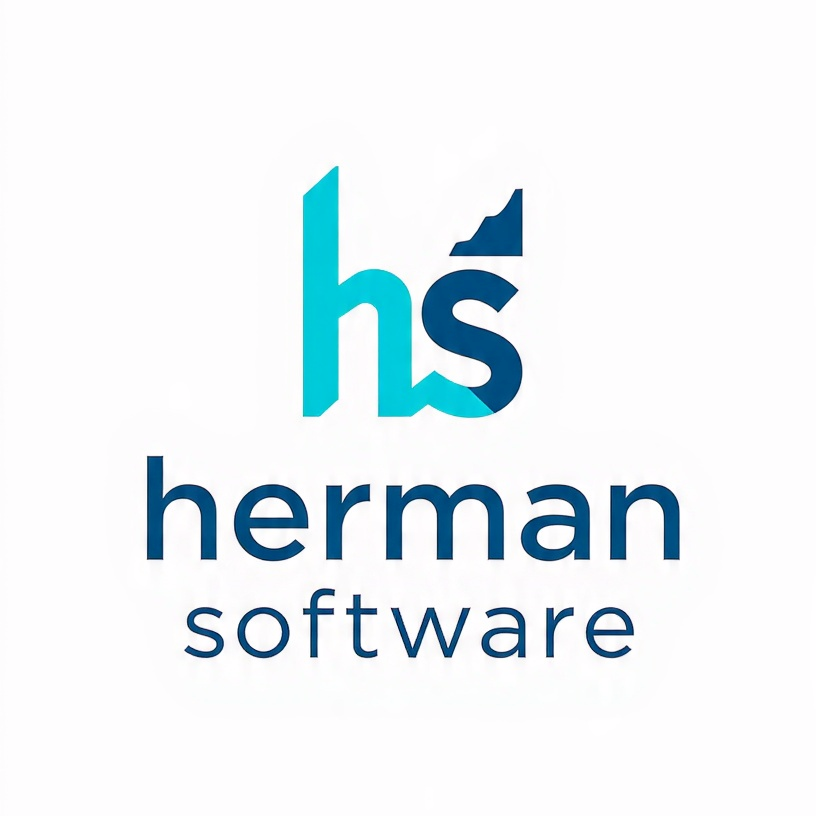
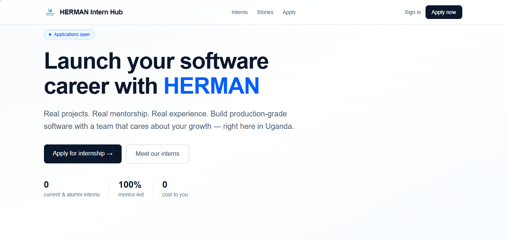
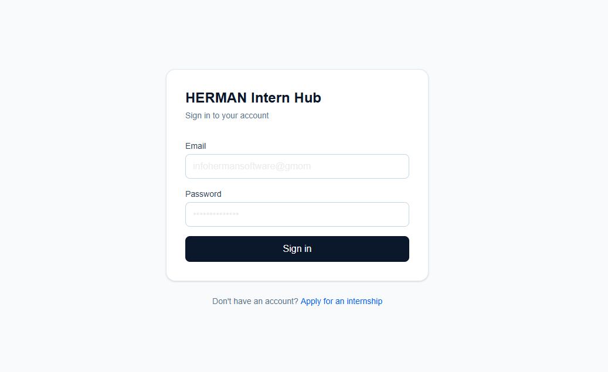
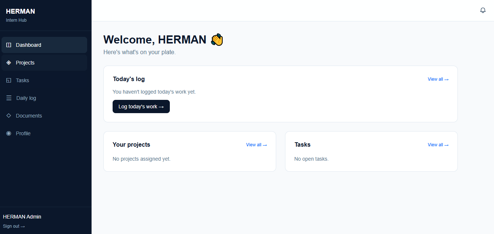

<div align="center">



# HERMAN Intern Hub

**Intern lifecycle management for [HERMAN Software Solutions Limited](https://herman-software-website.vercel.app)**

Apply → Approve → Onboard → Build → Review → Certify — all in one place.

[](https://herman-intern-hub.vercel.app)
[](./LICENSE)
[](https://nextjs.org)
[](https://supabase.com)

</div>

---

## What it is

HERMAN Intern Hub replaces spreadsheets, WhatsApp threads, and manual paperwork with a single, opinionated system for managing software internships end-to-end.

Built and used by **HERMAN Software Solutions Limited** (Jinja, Uganda).

## The full lifecycle
┌────────────┐ ┌──────────┐ ┌───────────┐ ┌─────────┐ ┌──────────┐ ┌──────────┐
│ Apply │ → │ Review │ → │ Invite │ → │ Onboard │ → │ Work │ → │ Certify │
│ (public) │ │ (admin) │ │ (email) │ │ (wizard)│ │ (tasks) │ │ (verify) │
└────────────┘ └──────────┘ └───────────┘ └─────────┘ └──────────┘ └──────────┘

text

Each stage is enforced by the system — you cannot skip ahead.

## Features

### For applicants
- 📝 Public multi-step application form — no login required
- 🔍 Application status checker by email
- 📧 Email confirmation on submission

### For interns
- 🚀 Onboarding wizard (profile → tech stack → agreement)
- 📋 Task workspace with file submissions
- 📆 Daily work log
- 📊 Auto-generated weekly reports (PDF + email)
- 🎓 Verifiable certificate + experience letter on completion
- 🔔 Real-time notifications

### For mentors
- 👥 Assigned intern roster
- ✅ Submission review queue with approve/revision workflow
- 💬 Feedback threads on every submission
- ⭐ Performance reviews with mentor + peer ratings

### For admins
- 📥 Applications inbox with approve/reject
- 🧑‍💼 Intern management (mentor assignment, dates, status)
- 📈 Analytics dashboard (KPIs, charts, log gaps, activity feed)
- 🎓 Certificate issuance (auto-computes performance score)
- 📜 Full audit log of every action

### For the public
- 🏠 Marketing landing page
- 👥 Browsable intern directory
- 🌟 Alumni success stories
- 🔍 Certificate verification at `/verify/[id]`

## Tech stack

| Layer | Technology |
|---|---|
| Framework | **Next.js 16** (App Router, Turbopack) |
| Styling | **Tailwind CSS** |
| Database | **PostgreSQL** via Supabase |
| Auth | **Supabase Auth** (invitation-only) |
| Storage | **Supabase Storage** |
| PDF | `@react-pdf/renderer` |
| QR codes | `qrcode` |
| Charts | `recharts` |
| Email | **Brevo** |
| Hosting | **Vercel** |

## Architecture highlights

- **No public signup** — every account flows through an invitation
- **Row-Level Security** on every table (60+ policies)
- **Middleware status gates** — routes enforce `intern.status`
- **Automatic activation** — assigning a mentor flips `onboarding → active` via DB trigger
- **Audit log** — every sensitive action recorded
- **Realtime notifications** — in-app bell updates via Supabase Realtime
- **Data-driven certificates** — performance score computed from real metrics (task completion, submission quality, log consistency, mentor rating)

## Quick start

### Prerequisites
- Node.js 20+
- A Supabase project
- A Brevo account
- A Vercel account (for deploy)

### 1. Clone

```bash
git clone https://github.com/HERMAN-Software-Solutions/herman-intern-hub.git
cd herman-intern-hub
2. Install
bash
npm install
3. Configure environment
bash
cp .env.example .env.local
Fill in the values (see .env.example for descriptions).

4. Set up the database
Run the SQL in docs/data-model.md in your Supabase SQL Editor. Then seed tech stacks (see docs/data-model.md § Seed).

5. Run
bash
npm run dev
Open http://localhost:3000.

6. Promote yourself to admin
After signing up (via an invitation you create yourself in Supabase Studio), run:

sql
UPDATE profiles
SET role = 'super_admin', status = 'active'
WHERE email = 'your-email@example.com';
Documentation
Doc	Purpose
SPEC.md	Full specification
ROADMAP.md	Phased delivery plan
docs/auth-flow.md	Approval + invitation state machine
docs/data-model.md	Database schema + RLS policies
docs/wireframes.md	Screen layouts
docs/certificate-spec.md	Certificate generation spec
docs/brand.md	Design tokens
CONTRIBUTING.md	How to contribute
Screenshots

<div align="center">

Public landing page


Login


Admin dashboard


</div>
Project structure
text
herman-intern-hub/
├── src/
│   ├── app/
│   │   ├── (public)        # Landing, apply, directory, verify
│   │   ├── admin/          # Admin dashboard
│   │   ├── dashboard/      # Intern portal
│   │   ├── invite/         # Invitation acceptance
│   │   ├── onboarding/     # Onboarding wizard
│   │   └── api/cron/       # Scheduled jobs
│   ├── components/
│   │   ├── marketing/      # Public-facing components
│   │   └── notifications/  # Bell + dropdown
│   ├── lib/
│   │   ├── supabase/       # 3 clients (browser, server, admin)
│   │   ├── email/          # Brevo integration
│   │   ├── certificates/   # PDF generation + scoring
│   │   ├── reports/        # Weekly reports
│   │   └── notifications/  # Notification helpers
│   └── middleware.ts       # Status gates
├── docs/                   # Specifications
├── public/brand/           # Logos, screenshots
└── SPEC.md
Deploy
The project is designed for Vercel:

Push to GitHub

Import in Vercel

Add environment variables (see .env.example)

Deploy

Note: Vercel's Hobby tier requires the GitHub repo to be public. Alternatively, keep the repo private and use Vercel Pro, or deploy to another platform that supports private repos on free tiers.

License
MIT © HERMAN Software Solutions Limited

Contact
📧 infohermansoftware@gmail.com

📞 +256 772 723 188

📍 Jinja, Gabula Rd, Uganda

🌐 herman-software-website.vercel.app

Quick links:

| Doc | Purpose |
|---|---|
| [Getting Started](./docs/getting-started.md) | Local setup guide |
| [SPEC.md](./SPEC.md) | Full specification |
| [ROADMAP.md](./ROADMAP.md) | Phased delivery plan |
| [Data Model](./docs/data-model.md) | Database schema |
| [Auth Flow](./docs/auth-flow.md) | Approval + invitations |
| [Certificate Spec](./docs/certificate-spec.md) | Certificate generation |
| [Wireframes](./docs/wireframes.md) | Screen layouts |
| [Brand Guide](./docs/brand.md) | Design tokens |
| [Contributing](./CONTRIBUTING.md) | How to contribute |

<div align="center"> <sub>Built with care in Jinja, Uganda 🇺🇬</sub> </div> ```